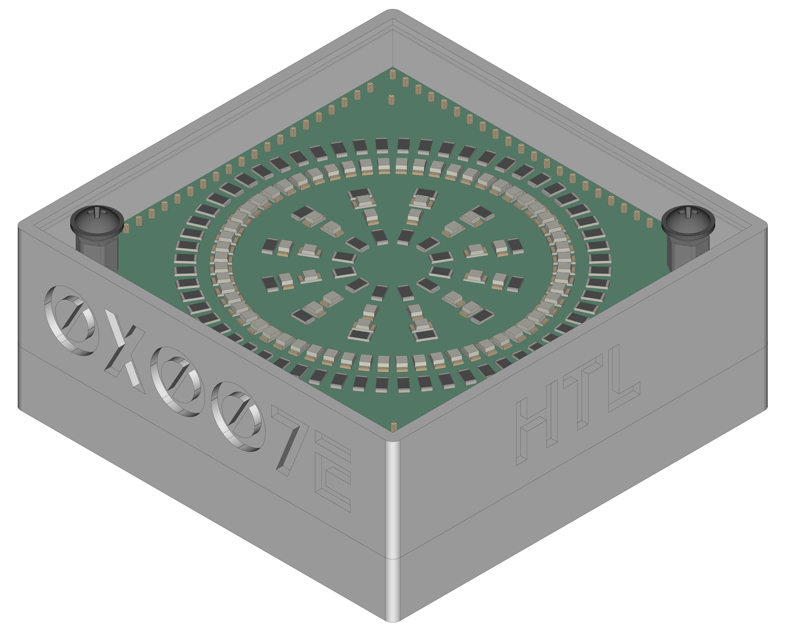
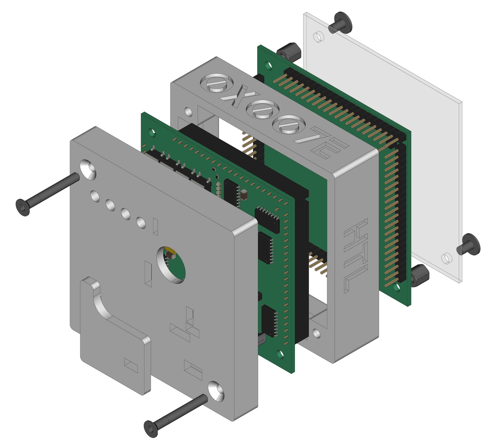
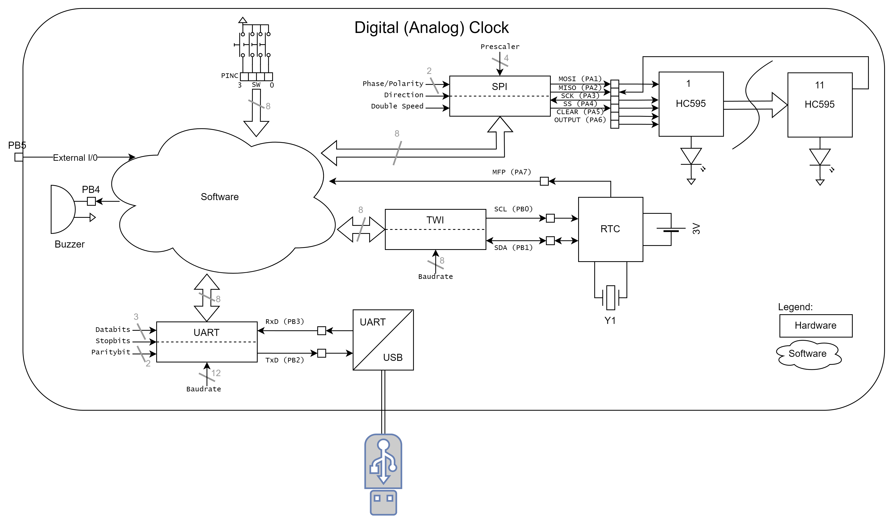
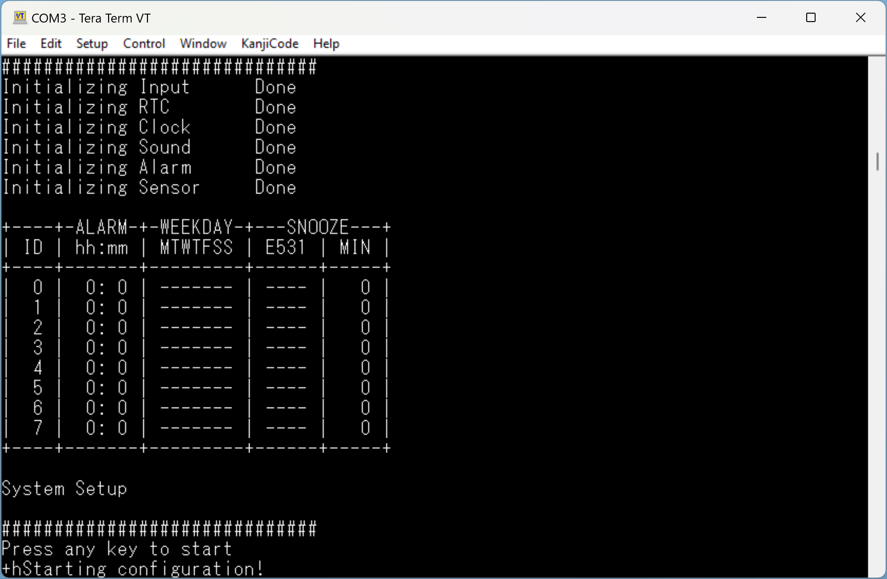

[](https://github.com/0x007e/diu)  [](https://creativecommons.org/licenses/by-nc-sa/4.0/legalcode)

# `DIU` - Digital (Analog) Clock (Digitaluhr)

The `DIU` project is based on a pcb with an [ATtiny1606](#additional-information) a RTC [MCP7940](#additional-information) a USB/UART bridge [FT232RL](#additional-information) and a set of [74HC595](#additional-information) shift register. It can be used to display time and date on 84 `LEDs` that are mounted in 3 circles to the top pcb. The clock itself can be setup over UART and a terminal software ([e.g. TeraTerm](#additional-information)).

| Experience | Level |
|:------------|:-----:|
| Soldering   |  |
| Mechanical  |  |
| Software    |  |

# Downloads

| Type      | File               | Description              |
|:---------:|:------------------:|:-------------------------|
| Schematic | [pdf](https://github.com/0x007E/diu/releases/latest/download/schematic.pdf) / [cadlab](https://cadlab.io/project/28616/main/files) | Schematic files |
| Board | [pdf](https://github.com/0x007E/diu/releases/latest/download/pcb.pdf) / [cadlab](https://cadlab.io/project/28616/main/files) | Board file |
| Drill | [pdf](https://github.com/0x007E/diu/releases/latest/download/drill.pdf) | Drill file |
| PCB | [zip](https://github.com/0x007E/diu/releases/latest/download/kicad.zip) / [tar](https://github.com/0x007E/diu/releases/latest/download/kicad.tar.gz) | KiCAD/Gerber/BoM/Drill files |
| Mechanical | [zip](https://github.com/0x007E/diu/releases/latest/download/freecad.zip) / [tar](https://github.com/0x007E/diu/releases/latest/download/freecad.tar.gz) | FreeCAD/Housing and PCB (STEP) files     |
| Firmware | [zip](https://github.com/0x007E/diu/releases/latest/download/firmware.zip) / [tar](https://github.com/0x007E/diu/releases/latest/download/firmware.tar.gz) | Firmware for ATtiny1606 |

# Hardware

There are two parts of the hardware. The pcb and the housing of the `DIU`. The pcb is created with [KiCAD](#additional-information) and the housing with [FreeCAD](#additional-information). The software is programmed with [Microchip (Atmel) Studio](#additional-information). All files are built with `github actions` so that they are ready for a production environment. The housing is printed with a 3D-printer (`Dremel 3D40`).

## PCB

The circuit board is populated on both sides (Top, Bottom). The best way for soldering the `SMD` components is within a vapor phase soldering system and for the `THT` components with a standard soldering system. After placing and soldering the top parts, the board has to be cut off in the middle (white edge).

### Top Layer


### Bottom Layer


## Mechanical

The housing has a tolerance of `0.2mm` on each side of the case. So the pcb should fit perfectly in the housing. The tolerance can be modified with `FreeCAD` in the `Parameter` Spreadsheet. The corners of the circuit board need to be sanded a little.

### Assembled



#### Exploded



# Programming/Setup

The `DIU` can be powerd with `5V` from USB or an external source through connector `J1`. Over [UPDI](#additional-information) (`J3`) the `DIU` can be programmed with `avr-dude` or an [Microchip (Atmel) ICE](#additional-information) adapter. To setup the `DIU` it can be connected over USB to a computer and  configured with a terminal (e.g. [TeraTerm](#additional-information)) software. The firmware for the clock can be downloaded from the [download section](#downloads).

## FUSES

| Register  | Value  |
|:---------:|:------:|
| `WDTCFG`  | `0x00` |
| `BODCFG`  | `0x00` |
| `OSCCFG`  | `0x02` |
| `TCD0CFG` | `0x00` |
| `SYSCFG0` | `0xF5` |
| `SYSCFG1` | `0x00` |
| `APPEND`  | `0x00` |
| `BOOTEND` | `0x00` |

> To setup `RESET` (`PA0`) it is necessary to change the `SYSCFG0`-FUSE of the `ATtiny1606`. WARNING: To reset the `PA0` pin to `UPDI` mode a `12V` impulse is necessary to program the FUSES again.

# Firmware

The firmware of the `DIU` project can be downloaded and modified with [Microchip Studio](#additional-information). The software can be found in the [`./firmware`](./firmware/) directory and is splitted into different libraries. They can be found in the [./firmware/lib`](./firmware/lib/) folder. Feel free to modify the firmware to your own needings.

## Dataflow diagram



## UART Setup

To configure the `DIU` through UART (USB/UART bridge) a connection over USB to a computer and a terminal software (e.g. [Teraterm](#additional-information) is necessary. To start the setup the following settings need to be configured in the terminal. Then hit a key during init process in the terminal.

| Name      | Value  |
|:---------:|:------:|
| PORT      | COM?   |
| BAUD      | 9600   |
| DATABITS  | 8      |
| PARITY    | NONE   |
| STOPBITS  | 1      |
| FLOWCTRL  | NONE   |

### Connection setup

``` bash
# +--------------------------------------------------+
# |       ~------------------+                       |      +---------------------+
# |      ~  ATTINY 1606      |                       |      |                     |
# |     ~                  +-+-+                     |      | +-----------------+ |
# |    ~               VCC | 1 |          +----------+      | | TeraTerm        | |
# |      ~             PB0 | 2 |          |   U  +---+---+  | | ~~~~~~~~        | |
# |        ~           PB1 | 3 |          |   S  |  USB  |--+ | ~~~~~           | |
# |         ~    (TxD) PB2 | 4 +-----+    |   B  +---+---+  | | ~~~~~~~~~~~~    | |
# |        ~     (RxD) PB3 | 5 +--+  |    |   /      |      | |                 | |
# |       ~            GND | 6 |  |  |    |   U      |      | +-----------------+ |
# |     ~                  +-+-+  |  |    |   A      |      |                     |
# |    ~~~~~-----------------+    |  |  +-+-+ R      |      | Computer            |
# |                               |  +--+TxD| T      |      |                     |
# |  DDD   IIIIII UU  UU          +-----+RxD| +------+      +---------------------+
# |  D  D    II   UU  UU                +-+-+ |5V/3V3|
# |  D  D    II   UU  UU                  +----+-----+
# |  DDD   IIIIII  UUUU                              |
# +--------------------------------------------------+
```

### Enter configuration menu

To enter into the configuration mode it is necessary to press a `key` during startup.



The configuration starts and a menu to setup the `DIU` appears.

``` bash
# +------------------------------------------------+
# | System Configuration                           |
# +------------------------------------------------+
# | [1] Time and Date                              |
# | [2] Alarm                                      |
# | [3] Alarm Tone                                 |
# | [4] LED Intensity                              |
# | [5] Oscillator                                 |
# | [d] Discharge changes                          |
# | [q] Exit configuration                         |
# +------------------------------------------------+
# Input:
```

## TWI-Configuration

The `DIU` itself uses a `RTC` ([MCP7940](#additional-information)) with a power reserve (`battery`) to store the time. The `firmware` is connecte to the `RTC` over `TWI`. The twi configuration is stored in [`twi.h`](./firmware/lib/twi/twi.h) and the rtc configuration in [`mcp7940.h`](./firmware/lib/rtc/mcp7940.h) file.

### Connection between `ATtiny1606` and `MCP7940`

``` bash
# +----------------------------------------------------------------------------------------------------+
# |                               VCC VCC                                                              |
# |                                ^   ^                                                               |
# |                                |   |                                                               |
# |                             R +++ +++ R                                                            |
# |                             9 | | | | 1                                                            |
# |       ~------------------+  9 | | | | 0                                J                           |
# |      ~  ATTINY 1606      |    +++ +++ 0    +---------------------+     1    ~~~~~~                 |
# |     ~                  +-+-+   |   |     +-+-+                 +-+-+   8   ~  3   ~                |
# |    ~               VCC | X +---|---|-----+ 8 | VCC         BAT | 3 +--(X)-+   V    +------| GND    |
# |    ~         (SCL) PB0 | 0 +---+---|-----+ 6 | SCL             +-+-+       ~  0   ~                |
# |     ~        (SDA) PB1 | 1 +-------+-----+ 5 | SDA      M        |          ~~~~~~   C30           |
# |       ~            PB2 | 2 |             +-+-+          C      +-+-+                 ||            |
# |        ~           PB3 | 3 |           +-+ 5 | MFP      P   X! | 1 +----------+------||----| GND   |
# |         ~          PB4 | 4 |          /  +-+-+          7      +-+-+         ---     ||            |
# |         ~          PB5 | 5 |         /     |            9        |         +-----+                 |
# |        ~           PB6 | 6 |        /    +-+-+          4        |         |  Y1 | 32.768 kHz      |
# |       ~            GND | X +-------/-----+ 4 |          0        |         +-----+                 |
# |      ~                 +-+-+      /      +-+-+                 +-+-+         ---     ||            |
# |     ~                    |       /         |                X2 | 2 +----------+------||----| GND   |
# |     ~                  +-+-+    /          |                   +-+-+                 ||            |
# |      ~                 ~   ~   /           +---------------------+                   C31           |
# |       ~                ~   ~  /                                                                    |
# |        ~           PA7 | 7 +-+             DDD   IIIIII UU  UU                                     |
# |         ~              +-+-+               D  D    II   UU  UU                                     |
# |         ~                |                 D  D    II   UU  UU                                     |
# |        ~-----------------+                 DDD   IIIIII  UUUU                                      |
# +----------------------------------------------------------------------------------------------------+
```

### TWI Parameter

To read and save parameters in th `RTC` over `TWI` the bus is configured with the following setup:

| Parameter | Value   | Description     |
|:----------|:-------:|:----------------|
| Speed     | 400kHz  | Bus clock speed |

> Detail can be found [here](https://en.wikipedia.org/wiki/I%C2%B2C)

### RTC-Commands

``` c
             void mcp7940_init(RTC_Mode battery);
             void mcp7940_battery(RTC_Mode mode);
             void mcp7940_oscillator(RTC_Mode mode);

    unsigned char mcp7940_oscillator_value(void);
             void mcp7940_oscillator_copy(Copy_Mode mode);

       RTC_Status mcp7940_powerfail_status(void);
       RTC_Status mcp7940_oscillator_status(void);

      const char* mcp7940_weekday_string(unsigned char day);
    
    unsigned char mcp7940_hour(RTC_Data data);
    unsigned char mcp7940_minute(RTC_Data data);
    unsigned char mcp7940_second(void);

    unsigned char mcp7940_weekday(RTC_Data data);
    unsigned char mcp7940_day(RTC_Data data);
    unsigned char mcp7940_month(RTC_Data data);
    unsigned char mcp7940_year(void);
    unsigned char mcp7940_leapyear(void);

       RTC_Status mcp7940_setweekday(unsigned char weekday);
       RTC_Status mcp7940_settime(unsigned char hour, unsigned char minute, unsigned char second);
       RTC_Status mcp7940_setdate(unsigned char day, unsigned char month, unsigned char year);
       RTC_Status mcp7940_setoscillator(unsigned char trim);
```

## SPI-Configuration

The `firmware` itself is driving the LEDs over `SPI` through eleven [74HC595](#additional-information) shift registers. The spi configuration is stored in the [`clock.h`](./firmware/lib/clock/clock.h) and [`spi.h`](./firmware/lib/spi/spi.h) files.

### Connection between `ATtiny1606` and `74HC595`

``` bash
# +------------------------------------------------------------------------------------------------------+
# |                                     +----------------------------... ~ ...------------------------+  |
# |       ~------------------+         /            START(1)            ~             END(11)         |  | 
# |      ~  ATTINY 1606      |        /        +---------------+       ~         +---------------+    |  |
# |     ~                  +-+-+     /       +-+-+  74HC595  +-+-+    ~        +-+-+  74HC595  +-+-+  |  |
# |    ~               VCC | X +----/--------+ 16|    VCC    |16 |-.. ~ ....---+ 16|    VCC    |16 |  |  |
# |    ~               PA0 | 0 |   /         +---+           +-+-+     ~       +---+           +-+-+  |  |
# |     ~       (MOSI) PA1 | 1 +--/----------+ 14| SER    QH | 9 |--... ~ ...--+ 14| SER    QH | 9 +--+  |
# |       ~     (MISO) PA2 | 2 +-+           +---+           +-+-+       ~     +---+           +-+-+     |
# |        ~     (SCK) PA3 | 3 +-------------+ 11|   SRCLK   |11 |----... ~ ..-+ 11|   SRCLK   |11 |     |
# |         ~     (SS) PA4 | 4 +-------------+ 12|    RCLK   |12 |----... ~ ..-+ 12|    RCLK   |12 |     |
# |         ~  (CLEAR) PA5 | 5 +-------------+ 10|   SRCLR   |10 |---... ~ ...-+ 10|   SRCLR   |10 |     |
# |        ~  (OUTPUT) PA6 | 6 +-------------+ 13|     OE    |13 |--... ~ ...--+ 13|     OE    |13 |     |
# |       ~            GND | X +-------------+ 8 |    GND    | 8 |-... ~ ...---+ 8 |    GND    | 8 |     |
# |     ~                  +-+-+             +-+-+           +-+-+    ~        +-+-+           +-+-+     |
# |    ~~~~~-----------------+                 +--+~~~~~~~~~+--+      ~          +--+~~~~~~~~~+--+       |
# |                                               |         |          ~            |         |          |
# |  DDD   IIIIII UU  UU                         ---  LED  ---          ~          ---  LED  ---         |   
# |  D  D    II   UU  UU                         \ /       \ /           ~         \ /       \ /         |
# |  D  D    II   UU  UU                          |         |             ~         |         |          |
# |  DDD   IIIIII  UUUU                           |         |             ~         |         |          |
# +------------------------------------------------------------------------------------------------------+
```

### SPI Parameter

To control the LEDs through the shift registers over `SPI` the bus is configured with the following setup:

| Parameter | Value   | Description |
|:----------|:-------:|:------------|
| Clock     | F_CPU/4 | Bus clock speed is system speed divied by 4 |
| Direction | MSB     | MSB needs to be transmitted first |
| Polarity  | Rising  | Polarity of clock is rising `_/` |
| Phase     | Rising  | Data is valid when clock is rising `_/` |

> Detail can be found [here](https://de.wikipedia.org/wiki/Serial_Peripheral_Interface)

### SPI Frame

``` bash

# SPI display transmission
# _                                                SS                                                   _
#  \__________________________________________________~~~______________________________________________/
#                                                 SCK   
#     __    __    __    __    __    __    __    __       __    __    __    __    __    __    __    __    
# ___/1 \__/2 \__/3 \__/4 \__/5 \__/6 \__/7 \__/8 \__~~~/81\__/82\__/83\__/84\__/85\__/86\__/87\__/88\___
#                                                 MOSI
#    __    __    __    __    __    __    __    __       __    __    __    __    __    __    __    __
# __/H \__/O \__/U \__/R \__/  \__/  \__/  \__/  \__~~~/M \__/I \__/N \__/  \__/L3\__/L2\__/L1\__/L0\____
#   \__/  \__/  \__/  \__/  \__/  \__/  \__/  \__/     \__/  \__/  \__/  \__/  \__/  \__/  \__/  \__/
#    [7                   :                    0]    [7                   :                    0]
#
# L[3:0] ... LEDs on the backside of the pcb for signaling
```

### Clock-Commands

``` c
           void clock_init(void);
           void clock_output(CLOCK_Status status);
           void clock_clear(void);
   unsigned int clock_intensity(void);
    CLOCK_Error clock_setintensity(unsigned int intensity);
           void clock_copy_intensity(Copy_Mode mode);
    CLOCK_Error clock_settime(unsigned char hour, unsigned char minute, unsigned char second, CLOCK_Status_LED status);
    CLOCK_Error clock_setdate(unsigned char day, unsigned char month, CLOCK_Status_LED status);
           void clock_setdata(unsigned long data24, unsigned long long data60, CLOCK_Status_LED status);
           void clock_saveintensity(void);
```

# Additional Information

| Type       | Link               | Description              |
|:----------:|:------------------:|:-------------------------|
| ATtiny1606 | [pdf](http://ww1.microchip.com/downloads/en/DeviceDoc/ATtiny806_1606_Data_Sheet_40002029A.pdf) | ATtiny microcontroller |
| MPC7940 | [pdf](https://ww1.microchip.com/downloads/aemDocuments/documents/MPD/ProductDocuments/DataSheets/MCP7940N-Battery-Backed-I2C-RTCC-with-SRAM-20005010J.pdf) | Battery-Backed I2C Real-Time Clock/Calendar with SRAM |
| FT232RL | [pdf](https://ftdichip.com/wp-content/uploads/2020/08/DS_FT232R.pdf) | USB Full Speed to Serial UART IC, Includes Oscillator and EEPROM |
| 74HC595 | [pdf](https://www.ti.com/lit/ds/symlink/sn74hc595.pdf?) | 8-Bit Shift Registers With 3-State Output Registers |
| Atmel ICE | [pdf](https://ww1.microchip.com/downloads/en/DeviceDoc/Atmel-ICE_UserGuide.pdf) | Atmel ICE datasheet |
| UPDI | [web](https://github.com/0x007e/updi) | UPDI-Adapter with AVR-Dude |
| Microchip Studio | [web](https://www.microchip.com/en-us/tools-resources/develop/microchip-studio) | Download page for Microchip Studio |
| KiCAD | [web](https://www.kicad.org/) | KiCAD project page |
| FreeCAD | [web](https://www.freecad.org/) | FreeCAD project page |
| TeraTerm | [web](https://github.com/TeraTermProject/teraterm/releases/download/v5.3/teraterm-5.3.zip) | Terminal software for UART |

---

R. GAECHTER
